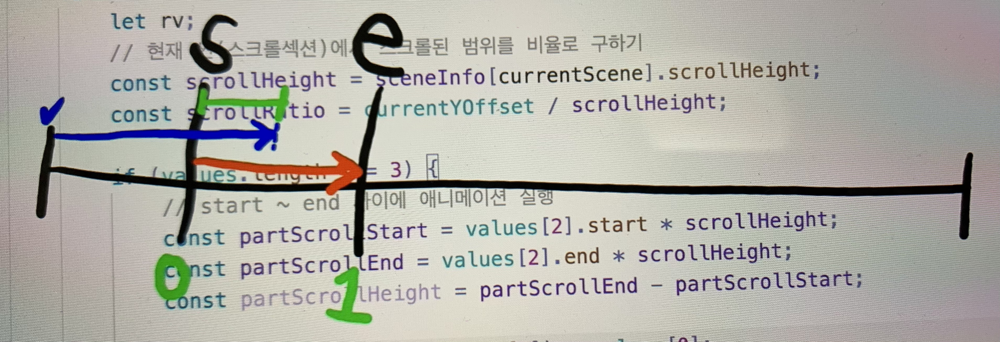
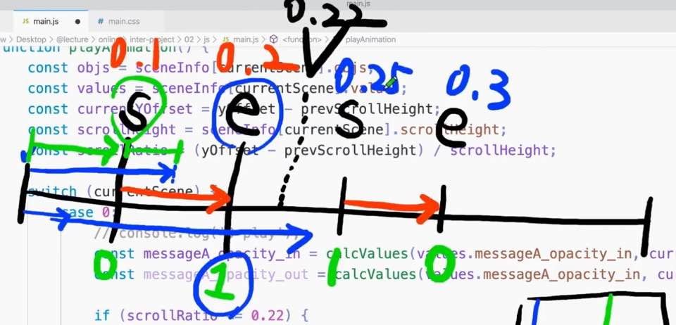

# 애플 클론

## 단위 rem, em
### em의 기준은 rem
```
html {
  font-size: 14px
}

.description strong {
  float: left;
  margin-right: 0.2em;
  font-size: 3rem;
  color: #000;
}
```
* 1rem = 14px
* rem의 기준은 '14px'
* .description strong 의 font-size = 14px * 3 = 42px
* .description strong 의 margin-right ( em ) = 42 * 0.2 = 8.4px 

## vw
* 뷰포트의 9% 
```
  #scroll-section-0 h1 {
    font-size: 9vw;
  }

```

## Timeline
* 해당 구역(보여지는 부분)에서만 animation을 재생하는 개념
* 스크롤 구분 단위가 짧으면 애니메이션이 빠르게 움직이고 길면 느리게 움직임
  * 프레임 요소
  * 요소들의 타이밍
  * 정보 -> 배열

### section0 
* 스크롤값에 따라 컵이 회전한다.
* text-animation 

### section1
* 그냥 scroll

### section2
* 컵을 들고 있는 손
* 각각의 설명이 올라옴

### section3
* 스크롤 되면서 이미지가 커짐

## JS
1. 한 섹션의 height를 window innerHeight의 다섯배로 설정
2. yOffset 과 prevScrollHeight, currentHeight를 이용해서 스크롤을 내릴때와 올릴때 함수 구현

## event 'load' vs 'DOMContentLoaded'
* **load**는 이미지, 영상 등 모두 로드 된 후에 스크립트가 실행되지만 **DOMContentedLoaded**는 html 태그들만 load한 후 실행. 따라서 **DOMContentLoaded** 의 로드 속도가 더 빠름 현재 실습에서는 이미지, 동영상의 역할이 중요하기에 **load** 이벤트를 실행


## scrollLoop 함수를 setLayout에도 세팅
* 스크롤루프는 스크롤 이동시에만 body에 id를 생성, 때문에 새로고침 혹은 화면이 처음 로드될 때에도 body id 를 생성하기 위해서 setLayout 함수에도 현재 스크롤 페이지를 세팅

## 각 section 안에서의 scroll 값
* 전제 pageYoffset 값에서 preScrollHeight 값을 빼줌

## translate3d
* 하드웨어 가속이 보장되기 때문에 퍼포먼스가 좋음


```
* 전체 세로 스크롤 = window.pageYOffseg (let yOffset);

* 각 section의 height를 5배로 늘려줌 ( scrollHeight )
  * scrollHeight = heightNum(5) * window.innerHeight;

* 현재 페이지 section 에 id를 설정 ** scrollLoop(), setLayout() **
  * preScrollHeight += sceneInfo[i].scrollHeight; ( for문 )
  * yOffset 과 preScrollHeight( sceneInfo의 height ) 를 비교해서 현재 section num 변경
  * document.body.setAttribute('id', `show-scene-${currentScene}`);

* 현재 페이지 안에서의 yOffset 설정 ( const currentYOsset, playAnimation() )
  * yOffset(전체) - preScrollHeight(이전 section들의 height 합)

* css 값 범위 설정을 위한 한 섹션 안에서의 비율을 설정 ( let scrollRatio, calcValues() )
  * 비율 = currentYOffset(전체 - 이전 section들 높이의 합) / 현재 section의 높이
  * 설정된 범위 값 안에서 움직이도록 하려면 '설정 끝값 - 설정 시작값 = 범위'
  * 시작 설정값을 맞춰야 하므로 '범위 + 설정 시작값'
  
* 한 section 안에서 요소들이 순서대로 보여지고 사라지는 값
  * messageA_opacity 에 start 시간과 end 시간 추가
  * ratio 반영 방법은 같으나 ratio가 적용되는 비율은 위에 선언된 값으로 대체
  * ** 비율은 전체분에 기준점에서 스크롤 된 값 **
```



## 비디오 제어

### 비디어로 제어하기
* 이렇게 비디오 제어할 시에 비디오 용량이 낮아지면 부드러운 이벤트 처리가 가능하지만 화질이 떨어지고 고해상도 비디오를 사용할 시 이미지가 깨지지는 않지만 이벤트 처리가 부드럽지 못함.
* loadeddata, canplaythrough
  * 공통점은 둘다 비디오 로드를 끝낸 후에 비디오 적용
  * canplaythrough 는 비디오 길이를 조절하면 계속 새로 고침 되고 loadeddata는 한번 비디오가 로드 되면 이후 실행
* duration 
  * 비디오의 전체 재생 시간을 가지고 있는 속성
* 스크롤 가동 범위는 끝까지 스크롤 했을때 더는 스크롤 할 필요가 없음으로 window.innerheight를 빼줌
* currentTime 비디오 관련 개발에서 currentTime 을 control 할 일이 있음

### 이미지 처리로 제어하기 (애플 채택 방식)
* 동영상을 프레임별로 이미지를 수백장을 생성하여 사용
* 애플에서도 이 방식을 사용
* 이미지 개수로 조정함 (ex_ let totalImageCount)
* 용량이 굉장히 크지만 부드러운 스크롤 처리까지 가능하다.
* 동영상 프레임 추출
* 이미지 압축 툴로 용량 최적화 시켜주고 사용

### canvas 사용 방법 (애플 채택 방식)
* canvas를 사용할 때에는 getContext를 사용
* canvas 사이즈는 이미지 사이즈로 fix 해놓고 css transform scale 로 크기 조정(성능이 좋고 간단한 방법)

## 새로운 객체 생성
* imgElem = new Image(); 
* document.createElement('img');

## canvas 사이즈 window.innerHeight랑 맞추는 작업
* window.innerHeight / 1080(본래 지정해두었던 canvans height) -> height 가 알맞게 들어감
* transform scale을 사용, top:0 속성이 있어도 scale 은 다른 요소에 영향을 받지 않기 때문에 붙지 않는다. 
  * 해결방법: top: 50%, height: 50%, transfrom: translate3d(-50%, -50%, 0)

## canvas draw
* 세로를 window와 inner와 맞출지 가로를 맞출지 선택 (playAnimation() ,setCanvasImages())
* 이미지 객체를 생성해서 src 넣어줌